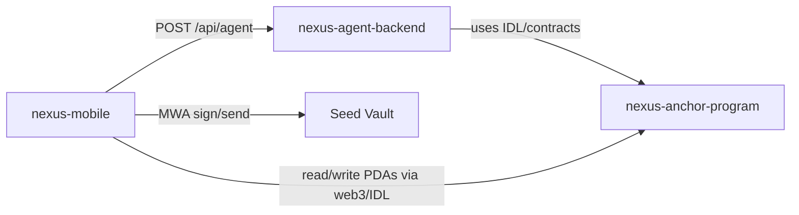

# Nexus Mobile App Design (MONOLITH 2026)

**Date:** 2026-02-20  
**Status:** Validated design (delivery-locked)  
**Primary Goal:** Ship a demo-ready Seeker-native AI agent app with one fully real end-to-end flow: intent -> policy check -> Seed Vault approval/sign -> on-chain execution -> receipt -> push/history update.

---

## 1. Product Goal and Constraints

Nexus is an AI agent OS for Solana on Seeker. The app must feel mobile-native, safe, and autonomous. The highest-value demo outcome is not broad feature coverage, but a reliable policy-gated swap flow that proves:

1. Agent reasoning and intent handling (chat + optional TTS)
2. Seeker trust UX (Seed Vault + fingerprint/double-tap signing)
3. Verifiable on-chain outcomes (execution receipts + notification)

### Hard constraints

- Time: 17-day MONOLITH sprint
- Platform: Android/Seeker first
- Wallet: MWA + Seed Vault, no in-app key custody
- Backend: mock-first contract, then real FastAPI endpoint
- Delivery policy: scope and milestone gates are binary; no cosmetic detours before core flow is green

---

## 2. Approaches Considered

### Option A: Vertical slice first (selected)

Build one real end-to-end flow early, then expand around it.

- Pros: de-risks demo, validates integration seams early, reduces late rewrite risk
- Cons: some secondary screens look basic until later milestones

### Option B: Foundation first

Build full infra layers before full user flow.

- Pros: clean internals
- Cons: high risk of no complete demo loop by deadline

### Option C: Demo UX first

Build polished mocks first, replace internals later.

- Pros: fast visual progress
- Cons: high integration risk and unstable late-stage behavior

**Decision:** Option A is the best fit for MONOLITH scoring and deadline pressure.

---

## 3. System Architecture

Use Expo + TypeScript with strict layering and service adapters.

### Stack

- Expo dev client (not Expo Go)
- TypeScript strict mode
- Expo Router for navigation
- `@solana-mobile/mobile-wallet-adapter-protocol` + web3.js wrapper
- `@solana/web3.js`
- `expo-local-authentication`, `expo-speech`, `expo-notifications`
- Firebase Cloud Messaging

### Initialization

Use official Solana Mobile template:

```bash
yarn create expo-app nexus --template @solana-mobile/solana-mobile-expo-template
```

### Layered structure

- `app/` (routes), `components/`, `screens` UI concerns only
- `contexts/` + `hooks/` orchestrate app state and flow
- `services/api`, `services/solana`, `services/mwa`, `services/notifications` encapsulate integrations
- `types/contracts.ts` defines API contracts shared with backend by disciplined mirroring

---

## 4. Repository and Delivery Topology

Create and maintain three repos in `nexus-seeker`:

1. `nexus-mobile` - Expo app
2. `nexus-agent-backend` - FastAPI reasoning/plan/tx builder
3. `nexus-anchor-program` - Anchor program + IDL (`PolicyVault`, `ExecutionReceipt`)

### Dependency map



### Git workflow

- Trunk-based, short-lived branches
- Conventional commits
- PR must map to a specific milestone acceptance criterion
- If a change does not close a gate criterion, it is out of scope

---

## 5. Core Runtime Flow (Single Source of Truth)

`AgentContext` owns finite execution states:

`idle -> reasoning -> plan_ready -> policy_check -> approval_required|approved -> signing -> submitted -> confirmed|failed`

### End-to-end flow

1. User enters intent in Chat screen
2. `agentClient` sends intent to backend (mock-compatible contract)
3. Response returns reasoning + executable proposal
4. `policyService` evaluates against cached and on-chain policy
5. If out-of-policy, show approval modal with exact limit delta
6. On confirm, `txService` triggers Seed Vault sign/send
7. Confirm transaction on-chain
8. Write/index `ExecutionReceipt`
9. Push notification delivered and History updates

`WalletContext` API stays minimal: `connect`, `connected`, `publicKey`, `signAndSend`, `disconnect`.

---

## 6. Contracts and Sync Rules

Keep explicit DTOs from day one:

- `AgentIntentRequest`
- `AgentPlanResponse`
- `PolicyEvaluation`
- `ExecutionReceiptDTO`

Manual mirroring rule:

- Any backend PR that changes contract shape must include corresponding mobile `types/contracts.ts` update in the same PR before merge.

This prevents runtime schema drift during sprint execution.

---

## 7. Error Handling and Security

Use typed result envelopes:

```ts
type Result<T> = { ok: true; value: T } | { ok: false; error: AppError };
```

`AppError` codes include:

- `backend_unavailable`
- `policy_blocked`
- `wallet_not_connected`
- `seed_vault_rejected`
- `tx_failed`
- `tx_unconfirmed`
- `notification_failed`

### Rules

- Auto-retry only read-only operations with bounded exponential backoff
- Never auto-re-sign failed signed operations
- Persist in-flight status for crash/restart recovery
- Validate backend payload schemas before execution
- No private key storage in app; Seed Vault signs all transactions
- Redact sensitive logs

---

## 8. Testing Strategy (Hybrid Device Checkpoints)

### Unit

- Policy evaluator
- State transitions
- Contract parsing/validation
- Receipt formatting

### Integration

- Mock backend responses
- Mock MWA wrappers
- Stubbed Solana RPC success/failure cases

### Device checkpoints

- Real Seeker validation at wallet/sign milestone
- Real Seeker validation at full vertical-slice milestone

### Demo gate tests

- Happy path (successful swap)
- Rejection path (policy exceeded with clear user explanation)

---

## 9. Milestones and Binary Exit Gates

### M0 (Day 1-2): Scaffold

Green when:

- Repos scaffolded
- CI (`lint/typecheck/test`) passes
- Expo dev client build installs
- MWA wallet connect works on physical device

### M1 (Day 3-5): Wallet + Policy Read/Write

Green when:

- `PolicyVault` deployed to devnet
- Policy can be created/updated from mobile
- Policy readback displays in app from on-chain PDA
- Policy write failure/rejection appears as explicit in-app error state (not silent failure)

### M2 (Day 6-9): Real Vertical Slice (Priority Gate)

Green when, from fresh install on physical device:

- Intent is submitted and parsed
- Policy check runs and routes correctly
- Seed Vault double-tap signing occurs
- On-chain tx is confirmed
- `ExecutionReceipt` is written/indexed
- Push notification is received
- History reflects new receipt
- Flow completes within 90 seconds from intent submission under normal devnet conditions
- Demo environment has no localhost dependency

### M3 (Day 10-13): Hardening and UX Clarity

Green when:

- Happy and rejection scripts are repeatedly reliable
- Retry/cancellation paths are stable
- TTS + notification paths are resilient

### M4 (Day 14-17): Stabilization and Submission

Green when:

- Bug bash complete
- APK build succeeds
- README + demo script + video assets ready

---

## 10. Scope Lock: Delivery Over Cosmetics

### Priority tiers

- **P0:** M0/M1/M2 only
- **P1 (after P0 green):** TTS polish, rejection UX polish, Genesis/.skr indicators, notification hardening
- **P2:** visual embellishments, advanced animations, optional share-card cosmetics

### Enforcement

- Every PR must close a concrete gate criterion
- If not tied to a gate criterion, defer it
- Deferred ideas are logged immediately in `DEFERRED.md` or `Post-M2` board

---

## 11. Freeze Protocol and Rollback

At T-2h before judging:

- Freeze environment to known-good tags
- Only blocker fixes allowed
- Single designated owner decides blocker status and records rationale in PR comments

Rollback rule:

- If a post-freeze fix introduces new failure, revert immediately to the tagged stable version.

Known-stable demo is preferred over risky last-minute changes.

---

## 12. Non-Goals Before M2 Green

- Full visual redesign system
- Non-essential feature expansion
- Secondary protocol integrations beyond required swap flow
- Refactors without gate impact

---

## 13. Definition of Success for MONOLITH Demo

Nexus is judged successful when a live device demo shows:

1. Natural-language intent submission
2. Agent reasoning and policy-aware behavior
3. Seed Vault approval/signing UX
4. Real on-chain execution
5. Verifiable receipt and proactive notification

This proves the three pillars in one coherent user journey: Agent Brain, Permission Vault, and Proof Layer.
