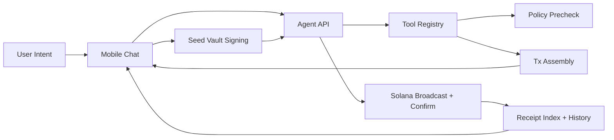

# NEXUS Payroll Copilot V1 - Design Document

**Date:** 2026-02-28
**Scope:** Small Teams and DAOs (marketed as power-user workflow)
**Status:** Validated

---

## 1. Product Direction and Success Criteria

### Core Product Wedge

NEXUS V1 is a chat-native USDC payroll copilot for small teams and DAOs.

The V1 magic moment:

1. User types payroll intent in natural language.
2. Agent resolves recipients and amounts.
3. Policy constraints are enforced before execution.
4. User approves once in Seed Vault.
5. Batch completes with receipts and audit trail.

This wedge is intentionally narrow. Payroll has higher transaction cadence than grants and treasury rebalancing, so it creates faster feedback loops and stronger retention learning.

### Primary V1 Metric

North-star metric:

- Percentage of teams that complete a second payroll run within 35 days of their first run.

Supporting metrics:

- Successful payroll runs per active team per month.
- Median time between first and second payroll run.
- Policy rejection clarity rate (users who understand and recover from rejection without support).

### Security Posture

V1 uses one human signer with strict on-chain policy enforcement.

PolicyVault is framed as an always-on co-signer:

- Daily spend caps.
- Protocol allowlists.
- Active/inactive kill switch behavior.
- On-chain receipts for immutable auditability.

---

## 2. Approaches Considered and Selected Strategy

### Option A: Payroll vertical slice first

- **Pros:** Fastest user-visible value.
- **Cons:** Hardcoded graph debt grows quickly when adding new tools.

### Option B: Architecture refactor first

- **Pros:** Clean long-term agent architecture.
- **Cons:** Delays live user value and retention signals.

### Option C: Parallel split (selected)

- **Pros:** Ships real payroll flow quickly while building durable architecture in parallel.
- **Cons:** Requires disciplined interface contracts and ownership boundaries.

### Why Option C Wins

Track A ships a working payroll flow now using minimal graph extensions.

Track B builds dynamic tool-calling architecture behind the same API and SSE contract.

When Track B matches Track A acceptance criteria, backend runtime swaps without forcing mobile rewrites.

---

## 3. Architecture and Component Boundaries

### High-Level Shape

Mobile remains a deterministic execution client.

Backend remains the reasoning and transaction assembly engine.

The mobile app should not depend on backend graph internals. It depends only on stable API payloads and stream events.



### Backend Tool Registry Interface

All tools expose normalized input and output contracts and structured error envelopes.

V1 payroll-relevant tools:

- `parse_intent`
- `resolve_recipients`
- `policy_precheck`
- `multi_send_usdc`
- `simulate_tx`
- `assemble_tx`

Track A may run these in fixed sequence. Track B uses a planner/executor loop.

### Mobile Components (V1)

- Chat intent composer with payroll-first suggestions.
- Step timeline cards mapped to tool-level progress events.
- ApprovalSheet with recipient rows, totals, fees, and policy status.
- Policy screen for caps, allowlists, signer identity, and active state.
- History/receipts screen with batch and recipient-level visibility.

---

## 4. Data Model and Contracts

### Payroll Intent DTO

```ts
type PayrollRecipient = {
  handleOrAddress: string;
  amountUi: string;
};

type PayrollIntent = {
  payerPubkey: string;
  mint: string; // USDC for V1
  recipients: PayrollRecipient[];
  note?: string;
};
```

### Resolved Plan DTO

```ts
type ResolvedPayrollRecipient = {
  input: string;
  resolvedPubkey: string;
  amountAtomic: string;
  resolutionSource: "skr" | "address";
};

type PayrollPlan = {
  runId: string;
  mint: string;
  recipients: ResolvedPayrollRecipient[];
  totalAtomic: string;
  estimatedFeeLamports?: number;
};
```

### Result Envelope

```ts
type ToolResult<T> =
  | { ok: true; value: T }
  | { ok: false; code: string; message: string; recoverable: boolean };
```

### Stream Event Compatibility Rule

Track A and Track B must emit equivalent externally visible events:

- same event types (`step`, `heartbeat`, `complete`, `error`)
- same step status semantics (`running`, `success`, `rejected`)
- same completion payload keys used by mobile UI

This is the hard compatibility seam that enables runtime swap without mobile refactor.

---

## 5. End-to-End Runtime Flow

### Execution Path

1. User submits payroll intent in chat.
2. `parse_intent` extracts recipients/amounts and target mint.
3. `resolve_recipients` maps `.skr` and raw addresses; unresolved entries are returned with clear errors.
4. `policy_precheck` validates projected spend and protocol permissions.
5. `multi_send_usdc` builds transfer instructions (including ATA create-if-missing).
6. `simulate_tx` estimates fee and catches known execution failures.
7. `assemble_tx` returns unsigned versioned transaction plus summary.
8. Mobile shows ApprovalSheet with full recipient breakdown.
9. User signs once via Seed Vault.
10. Backend broadcasts signed tx and waits for confirmation.
11. Receipt is indexed and surfaced in history.

### Policy Semantics

- Precheck is for user clarity and early rejection.
- On-chain enforcement remains authoritative.
- If policy changes between precheck and sign, on-chain rejection still protects funds.

### UX Trust Requirements

ApprovalSheet must show:

- number of recipients
- per-recipient amount
- total USDC amount
- estimated fee
- policy status (within limit or blocked with exact reason)

---

## 6. Error Handling and Recovery

### Error Classes

- `intent_parse_failed`
- `recipient_resolution_failed`
- `policy_blocked`
- `tx_assembly_failed`
- `simulation_failed`
- `seed_vault_rejected`
- `broadcast_failed`
- `confirmation_timeout`

### Recovery UX

- Parsing errors: ask for reformatted payroll statement with example.
- Resolution errors: isolate invalid recipients; allow quick edit and retry.
- Policy blocked: show exact violating field and deep-link to policy screen.
- Simulation failures: show plain-English reason and suggested safe adjustment.
- Signing rejection: preserve prepared plan so user can retry without retyping.
- Broadcast/confirm issues: show pending state and allow background reconciliation.

### Non-Negotiable Rules

- Never auto-retry signed operations.
- Retry only read/network operations with bounded backoff.
- Persist in-flight run state to survive app restarts.

---

## 7. Testing and Verification Strategy

### Track A (Vertical Slice)

- Integration tests for payroll happy path.
- Integration tests for policy rejection path.
- UI tests for ApprovalSheet arithmetic and recipient rendering.
- End-to-end devnet rehearsal scripts for real signing and confirmation.

### Track B (Dynamic Tool Architecture)

- Planner tests for tool selection and stop conditions.
- Executor loop tests for error propagation and recovery.
- Contract tests ensuring stable SSE/event payloads.
- Golden tests comparing Track A vs Track B external behavior.

### Manual Device Checklist (P0)

- First payroll run from clean install.
- Seed Vault sign path success.
- Policy-rejected payroll with clear guidance.
- App restart during in-flight run and state recovery.
- History reconciliation after confirmed tx.

---

## 8. Rollout Plan and Scope Guardrails

### Rollout Phases

1. Internal alpha (2-5 teams, capped amounts, frequent guided runs).
2. Closed beta (10-20 teams, broader recipient edge cases).
3. Public V1 (payroll-first messaging, feature flags for non-payroll tools).

### Scope Lock for V1

Must-have:

- Chat payroll intent parsing
- USDC multi-send in one flow
- Policy-enforced approval path
- Receipt trail and history visibility

Deferred until retention KPI is healthy:

- true multi-signer workflow
- timelock/cancel workflows
- lending and staking expansion
- NFT tooling

### Definition of V1 Success

NEXUS is successful when teams can run recurring payroll through one chat flow with policy-enforced trust and return for the next payroll cycle.
